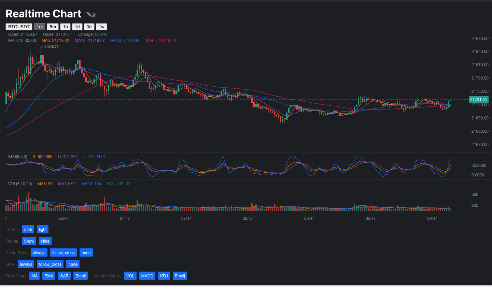
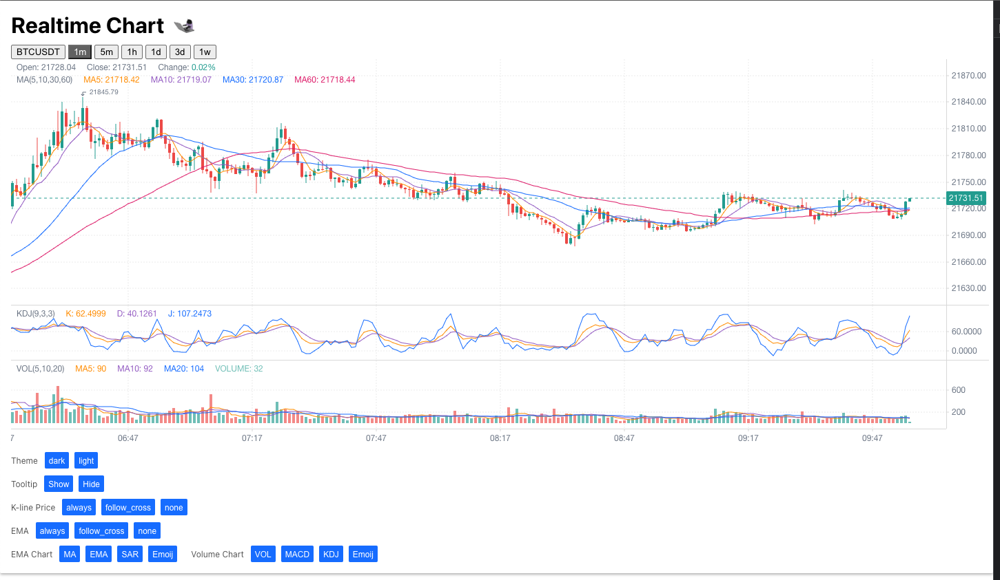

# Kline Chart Trading Crypto (BTCUSD)

Sample app for kline chart by BTCUSD
 
Love by [@dilysngo](https://www.github.com/dilysngo)



|       ThemeDark       |       ThemeLight       |
| :-------------------: | :--------------------: |
|  |  |

## <h2> To run it </h2>

Go to the project directory:

```bash
  cd Detector
```

Install dependencies:

```bash
  npm i
```

Run the project:

```bash
  npm start
```

Run the test:

```bash
  npm test
```

### Love by

- [@dilysngo](https://www.github.com/dilysngo)
